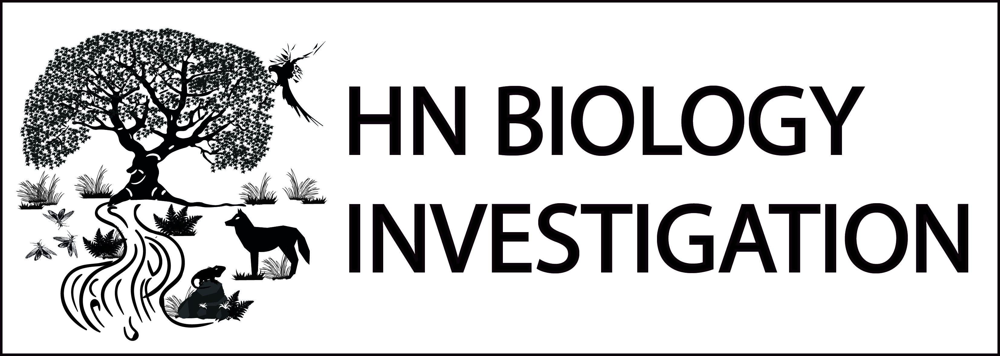

  <h1 style="margin:0;">Clase 10: Repaso, Preguntas y respuestas</h1>
  

¡Felicidades por haber finalizado tu curso de estadísticas para estudios en ecología! Estoy seguro de que ha sido un trabajo duro, pero también estoy seguro de que has aprendido mucho y has adquirido una sólida base en estadísticas para poder aplicarla a tus investigaciones ecológicas.

Recuerda que el aprendizaje nunca termina, y siempre hay más cosas que puedes aprender y más profundidades a las que puedes sumergirte. No tengas miedo de seguir explorando y aprendiendo más sobre estadísticas y ciencias de la vida. La curiosidad es el motor del conocimiento y el progreso, y siempre hay algo nuevo y emocionante por descubrir.

Mantén la motivación y el entusiasmo por aprender y hacer aportes significativos a tu campo. Tienes el potencial y las herramientas para lograr grandes cosas, y estoy seguro de que te llevarás mucho éxito en tu carrera. ¡Sigue adelante y sigue brillando!

